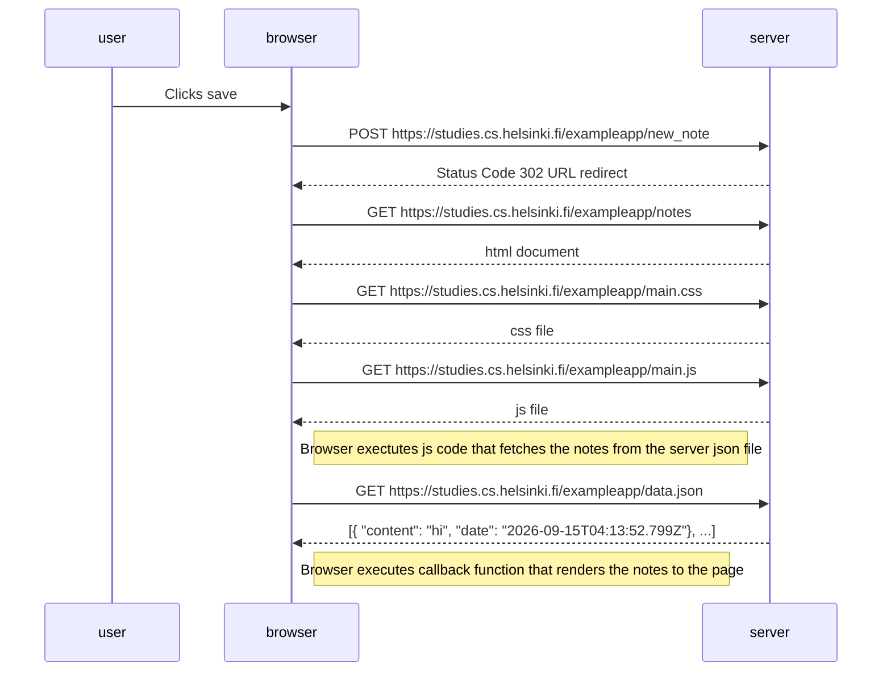

```mermaid
sequenceDiagram
    participant user
    participant browser
    participant server

    user->>browser: Clicks save
    browser->>server: POST https://studies.cs.helsinki.fi/exampleapp/new_note
    server-->>browser: Status Code 302 URL redirect
    browser->>server: GET https://studies.cs.helsinki.fi/exampleapp/notes
    server-->>browser: html document
    browser->>server: GET https://studies.cs.helsinki.fi/exampleapp/main.css
    server-->>browser: css file
    browser->>server: GET https://studies.cs.helsinki.fi/exampleapp/main.js
    server-->>browser: js file
    Note right of browser: Browser exectutes js code that fetches the notes from the server json file
    browser->>server: GET https://studies.cs.helsinki.fi/exampleapp/data.json
    server-->>browser: [{ "content": "hi", "date": "2026-09-15T04:13:52.799Z"}, ...]
    Note right of browser: Browser executes callback function that renders the notes to the page
```
