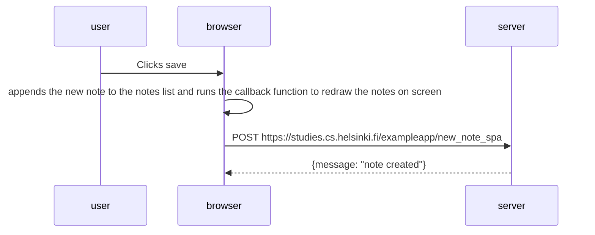

```mermaid
sequenceDiagram
    participant user
    participant browser
    participant server

    user->>browser: Clicks save
    browser->>browser: appends the new note to the notes list and runs the callback function to redraw the notes on screen
    browser->>server: POST https://studies.cs.helsinki.fi/exampleapp/new_note_spa
    server-->>browser: {message: "note created"}
```
